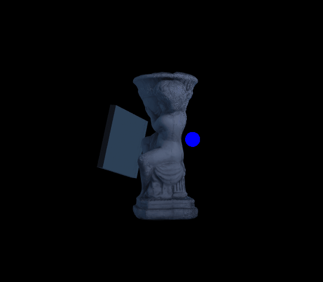

# Python Libraries for Meshes and Point Clouds
Repository for the code used in the Medium articles about Python libraries for 3D analysis, visualization and manipulation of point clouds and meshes.

Each folder contains different Towards Data Science articles. In the folders there are the used data and Python files. Each of the .py files here contains the code for one of the presented Python libraries. For installation and initial setup, please check the Medium articles. For overview of what each script does, please look at the readme explanations in each folder.

The used angel statue mesh and point cloud, bunny statue point cloud and rooster statue can be found in the folders or can be downloaded as part of larger Photogrammetry datasets - [HERE](https://doi.org/10.17632/bzxk2n78s9.4) and [HERE](https://doi.org/10.17632/xtv5y29xvz.2). These datasets were part of these publications - [here](https://link.springer.com/chapter/10.1007/978-3-319-48496-9_2) and [here](https://www.mdpi.com/1424-8220/20/19/5725/htm)
The used dataset can be also downloaded from [HERE](https://www.kaggle.com/datasets/ivannikolov/longterm-thermal-drift-dataset) and is a part of this [publication](https://vbn.aau.dk/ws/files/452153692/paper.LjjqegBNtPi.pdf)

You can follow the series of articles:
 - [Python Libraries for Mesh, Point Cloud, and Data Visualization (Part 1)](https://towardsdatascience.com/python-libraries-for-mesh-and-point-cloud-visualization-part-1-daa2af36de30) 
 - [Python Libraries for Mesh, Point Cloud, and Data Visualization (Part 2)](https://towardsdatascience.com/python-libraries-for-mesh-point-cloud-and-data-visualization-part-2-385f16188f0f#3a19-c5ba22819880)
 - [How to Voxelize Meshes and Point Clouds in Python](https://towardsdatascience.com/how-to-voxelize-meshes-and-point-clouds-in-python-ca94d403f81d)

# Examples from the articles
Ray tracing using PlotOptiX

Dataset 3D interactive visualization using PyVista

Voxelization and interactive thresholding

